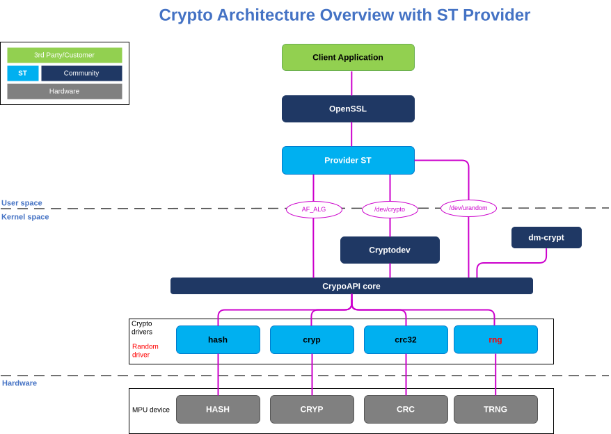

# STM32MPU Provider

In OpenSSL terms, a provider is a unit of code that offers implementations for cryptographic operations such as digests, ciphers, signatures, and more.

STM32 Provider offloads cryptographic operations for security peripherals embedded in ST MPUs, through the Linux AF_ALG and Cryptodev.

Here is a overviweuw of the CryptoAPI architecture, from User space to hardware :

# CryptoAPI Architecture with STM32MPU Provider  

# Benchmark Results on STM32MP25 :

See the latest performance reports here:

## For Digest :

👉 https://mxvxzzz.github.io/stm32mpu-benchmarks/digest.html

## For cipher : AES : ECB/CBC/CTR (128/192/256) :

👉 https://mxvxzzz.github.io/stm32mpu-benchmarks/cipher.html
